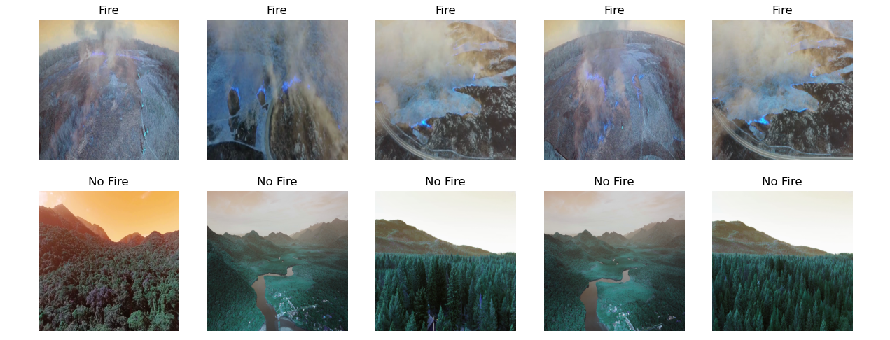
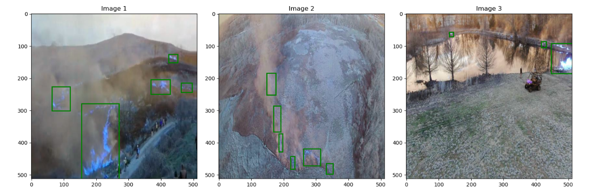
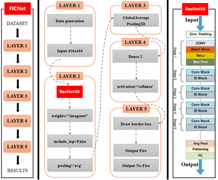

# Research on Fire Classification and Detection Models Based on Deep Learning

Shenzhi Li, Biao Zhang, Peng Wang

___________

The code in this toolbox implements the ["Research on Fire Classification and Detection Models Based on Deep Learning"](https://www.sciencedirect.com/science/article/abs/pii/S0034425723004078). Fires pose severe risks, and fires in forests threaten human and animal life and negatively affect their quality of life, in addition to their impact on infrastructure, with limited options for fighting fires due to the intense heat and volatile winds. In this fragile environment, responsible behavior and fire prevention is essential to mitigate these risks.The importance of this project lies in working on continuous monitoring to discover and identify fires, in addition to early detection and reducing the response speed.

A high-resolution domain adaptation network utilizing adversarial learning (HighDAN) is devised to tackle this task.

Citation
---------------------

**Please kindly cite the papers if this code is useful and helpful for your research.**

Shenzhi Li, Biao Zhang, Peng Wang. Research on Fire Classification and Detection Models Based on Deep Learning. International Conferenge on Big Data and Data Mining, 2024, xx: yyyy. 

     @article{li2024cross,
     title={Research on Fire Classification and Detection Models Based on Deep Learning},
     author={Shenzhi Li, Biao Zhang, Peng Wang},
     journal= International Conferenge on Big Data and Data Mining},
     volume={xxx},
     pages={yyyy},
     year={2024}
     }

System-specific notes
---------------------
Please refer to the file `requirements.txt` for the running environment of this code.

:exclamation: The datasets can be downloaded from the following links:

Baiduyun: https://pan.baidu.com/s/1zwE-Y_AJYaLOMPkIzgTTug?pwd=qwer 

Licensing
---------

This program is free software: you can redistribute it and/or modify it under the terms of the GNU General Public License as published by the Free Software Foundation, version 3 of the License.

This program is distributed in the hope that it will be useful, but WITHOUT ANY WARRANTY; without even the implied warranty of MERCHANTABILITY or FITNESS FOR A PARTICULAR PURPOSE. See the GNU General Public License for more details.

You should have received a copy of the GNU General Public License along with this program.

Contact Information:
--------------------

Shenzhi Li: d24092110646@cityu.edu.mo 
Shenzhi Li is with the City University of Macau, Macau, China.
